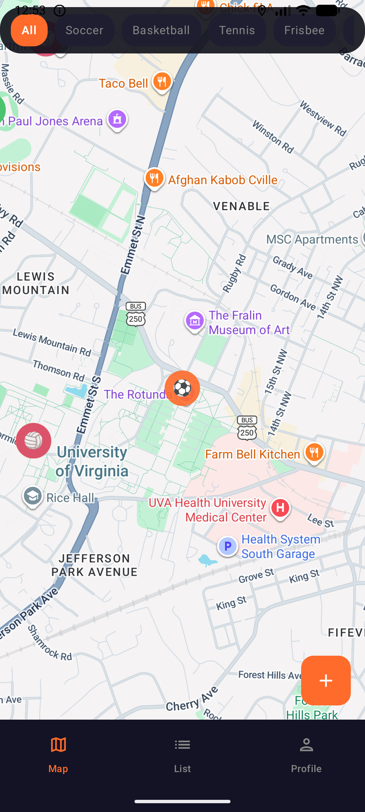
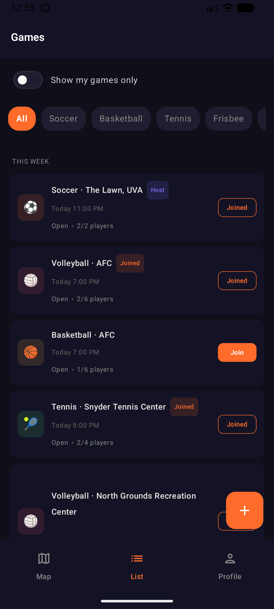
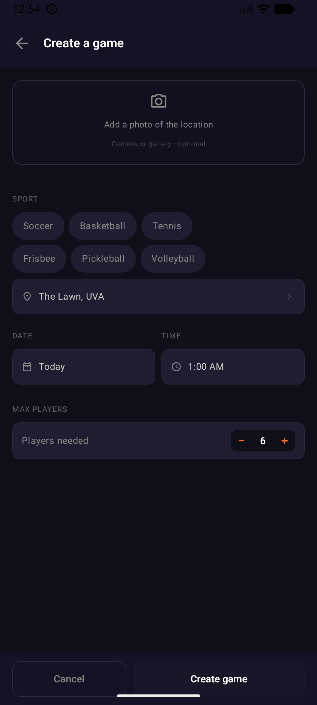

# Pickup-Hoos

A native Android app for UVA students to organize and join pickup sports games across Grounds. Built solo as a full-stack mobile project after noticing how hard it was to find a casual game of soccer or basketball without already knowing someone in a group chat.

## What it does
- Post a pickup game (sport, time, location, max players)
- Browse nearby games on a map (Mad Bowl, IM fields, etc.)
- Join games with one tap; live RSVP updates without refresh
- Auth + persistent profiles via Firebase

## Screenshots

  
  
  

## Stack
- **Mobile:** Kotlin, Android SDK, Material 3
- **Backend:** Firebase Authentication, Cloud Firestore (real-time listeners)
- **Maps:** Google Maps SDK with location-based discovery
- **Networking:** Retrofit + Kotlin coroutines

## Architecture notes
- Firestore schema: `users`, `games`, `rsvps` collections with denormalized reads for game-list views to minimize query cost
- Real-time updates use Firestore listeners (no polling)
- Auth state observed via Firebase callbacks; UI reactive to login changes

## Status
Personal project, Spring 2026. Tested locally with 8 users across 5 sports. Not currently deployed publicly.

## Run it
1. Clone, open in Android Studio
2. Add your own `google-services.json` (Firebase project)
3. Add a Maps API key in `local.properties`
4. Build and run on emulator or device